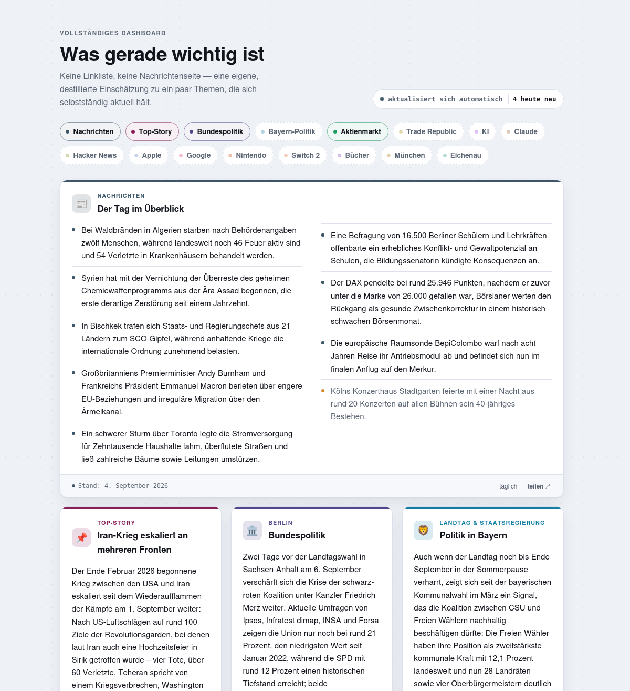
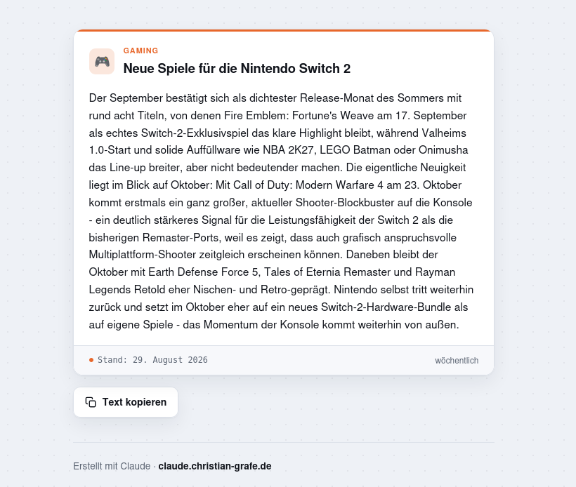

# news-dashboard

Ein selbstpflegendes Nachrichten-Dashboard: keine Linkliste, kein RSS-Reader,
sondern **Claudes eigene, destillierte Einschätzung** zu einer Handvoll Themen —
täglich bis wöchentlich neu recherchiert, je nach Thema.



Live: [claude.christian-grafe.de/dashboard/](https://claude.christian-grafe.de/dashboard/)

Das Besondere ist nicht die Optik, sondern die **Sparsamkeit**: Ein Cron-Lauf
prüft jeden Morgen, welches Thema überhaupt fällig ist, und startet nur dafür
ein Sprachmodell. Ein Thema, das auf vier Dashboards steht, wird trotzdem nur
einmal recherchiert. Die gesamte Automatik kostet dadurch rund 2 $ pro Tag statt
eines Vielfachen.

---

## Inhalt

- [Wie es funktioniert](#wie-es-funktioniert)
- [Warum es so wenig kostet](#warum-es-so-wenig-kostet)
- [Bauteile](#bauteile)
- [Ein Durchlauf, Schritt für Schritt](#ein-durchlauf-schritt-für-schritt)
- [Neues Thema anlegen](#neues-thema-anlegen)
- [Neues Dashboard anlegen](#neues-dashboard-anlegen)
- [Einzelseite je Thema](#einzelseite-je-thema)
- [Darstellungsformate](#darstellungsformate)
- [Farben](#farben)
- [Frische-Anzeige](#frische-anzeige)
- [Verhalten als Homescreen-App](#verhalten-als-homescreen-app)
- [Einrichtung](#einrichtung)
- [Fallstricke](#fallstricke)

---

## Wie es funktioniert

Es gibt **mehrere Dashboards**, die sich Themen teilen können:

| Dashboard | Themen |
|---|---|
| Vollständig | Nachrichtenüberblick, Top-Story, Bundespolitik, Bayerische Politik, Aktienmarkt, Trade Republic, KI, Claude & Anthropic, Hacker News, Apple, Google, Nintendo, Switch 2, Bücher, München, Eichenau |
| Regional | Nachrichtenüberblick, Top-Story, Bundespolitik, Bayerische Politik, München, Eichenau, SDP, Tourismus in Bayern |
| Gaming | Nachrichtenüberblick, Top-Story, Ingolstadt, Immobilienmarkt Ingolstadt, PlayStation, PS-Spiele, Nintendo, Switch 2, Bücher, KI, Claude & Anthropic, Hacker News |
| Kompakt | Nachrichtenüberblick, Top-Story, Braunschweig, Wabeviertel |

> Die mitgelieferte `dashboards.json` ist eine **anonymisierte Beispiel­konfiguration**
> mit `example.com`-Adressen. Im real laufenden System heißen die vier Seiten
> nach ihren Nutzern und zeigen auf eine echte Domain. Themenzuschnitt und
> Struktur sind identisch — es sind wirklich diese vier Kombinationen.

**Der zentrale Kniff:** Ein Thema hat genau *einen* Zustand und wird deshalb auch
nur *einmal* recherchiert — egal, auf wie vielen Dashboards es erscheint. Der
Nachrichtenüberblick steht auf allen vier Seiten und kostet trotzdem einen
einzigen Lauf pro Tag. Themen, die kein Dashboard verwendet, werden gar nicht
erst geprüft.

Der Ablauf pro Thema:

```
        ┌──────────────────────────────────────────────┐
        │  Cron, täglich 6:10                          │
        └───────────────────┬──────────────────────────┘
                            ▼
                ist das Thema fällig?          ← kostet nichts,
           (letzter_check + cadence_days)        reines Datumsrechnen
                            │
                ┌───── nein ┴ ja ─────┐
                ▼                     ▼
            überspringen      Claude-Lauf (Sonnet)
                              recherchiert per WebSearch,
                              vergleicht mit dem alten Stand
                                      │
                          ┌── unverändert ─┴─ geändert ──┐
                          ▼                              ▼
                 nur letzter_check              neuer Text in den
                 hochzählen                     State schreiben
                                      │
                                      ▼
                        alle Seiten neu rendern,
                        nur inhaltlich Geändertes hochladen
```

## Warum es so wenig kostet

Vier Sparmechanismen greifen ineinander:

1. **Fälligkeit vor Ausgabe.** Der teure Teil (ein Sprachmodell) startet erst,
   wenn das Datumsrechnen sagt, dass ein Thema dran ist. Ein Thema im
   Wochentakt läuft an sechs von sieben Tagen gar nicht.
2. **State am Thema, nicht am Dashboard.** Geteilte Themen kosten einen Lauf,
   nicht vier.
3. **„Unverändert" ist ein gültiges Ergebnis.** Bei dünner Nachrichtenlage
   schreibt das Modell ausdrücklich nichts Neues — das kostet zwar den Lauf,
   verhindert aber aufgeblähte Pseudo-Neuigkeiten.
4. **Upload nur bei echter Änderung.** Der Generator vergleicht das Ergebnis
   byteweise mit der vorhandenen Datei und meldet nur wirklich geänderte Seiten.

Gemessen über 31 Tage: die gesamte Automatik dieses Projekts (rund 170 Läufe
im Monat) entspricht etwa 59 $ API-Gegenwert. Der teuerste Einzelposten ist der
tägliche Nachrichtenüberblick mit rund 16 $, weil er als einziger jeden Tag
läuft und breit über mehrere Ressorts recherchiert.

## Bauteile

| Datei | Rolle |
|---|---|
| `dashboard/blocks.json` | **Themen-Registry**: ein Eintrag je Thema (Titel, Icon, Farben, Takt, Rechercheanweisung) |
| `dashboard/dashboards.json` | **Seiten-Registry**: welches Dashboard zeigt welche Themen, unter welcher Adresse |
| `dashboard/site.json` | **Adress-Registry**: `basis_url` der Seite, Ordnername der Themenseiten |
| `dashboard/template.html` | gemeinsame Design-Vorlage mit `%%PLATZHALTER%%` |
| `dashboard/template-thema.html` | Vorlage der [Einzelseite je Thema](#einzelseite-je-thema) |
| `dashboard/thema-index.html` | Sperrseite für `/thema/`, wird unverändert kopiert |
| `dashboard/assets/` | Icons fürs Homescreen (SVG-Quelle + gerenderte PNGs) |
| `state/dashboard/<id>.json` | Gedächtnis je **Thema** (nicht je Dashboard) |
| `skills/dashboard-update/SKILL.md` | die Rechercheanweisung an das Modell |
| `bin/dashboard-update.sh` | Cron-Dispatcher: Fälligkeit → Modelllauf → bauen → hochladen |
| `bin/dashboard_apply.py` | Parser: Modellausgabe → State. Kein Modellaufruf |
| `bin/dashboard_build.py` | Generator: Vorlage + State → HTML, prüft dabei die Farbabstände. Kein Modellaufruf |
| `bin/dashboard_farbe.py` | Farbmathematik: sRGB ↔ OKLab/OKLCH, Abstand, Kontrast |
| `bin/dashboard_farben.py` | Werkzeug: Palette prüfen, Vorschlag rechnen, anwenden |
| `bin/dashboard_farbvorschau.py` | baut eine Vergleichsseite für Farbvorschläge |

Bewusst getrennt: **Der Skill fasst keine Dateien an.** Er bekommt Thema und
bisherigen Stand komplett über den Prompt herein und gibt seine Antwort in einem
streng geparsten Format zurück. Alles Mechanische passiert außerhalb, in zwei
kleinen Python-Skripten ohne jede Modell-Abhängigkeit. Dadurch ist jeder Fehler
eindeutig zuzuordnen — entweder hat das Modell schlecht recherchiert, oder das
Skript hat schlecht geparst, aber nie beides gleichzeitig.

## Ein Durchlauf, Schritt für Schritt

`bin/dashboard-update.sh` ohne Argumente:

1. **Sperre setzen** (`flock`), damit nie zwei Läufe parallel arbeiten.
2. **Fälligkeitsliste bauen.** Ein eingebettetes Python-Schnipsel liest
   `blocks.json`, `dashboards.json` und alle States und gibt eine Zeile je Thema
   aus — Felder getrennt durch `0x1F`, nicht durch Tab (siehe
   [Fallstricke](#fallstricke)). Fällig ist ein Thema, wenn seit
   `letzter_check` mindestens `cadence_days` Tage vergangen sind.
3. **Je fälligem Thema ein `claude -p`-Aufruf** mit dem Skill, der
   Rechercheanweisung und dem bisherigen Stand. `stdin` liegt auf `/dev/null`,
   sonst frisst der Aufruf die restlichen Zeilen der Schleife.
4. **`dashboard_apply.py`** parst die Ausgabe und schreibt den State — oder
   bricht mit Exit-Code 1 ab und schreibt gar nichts.
5. **`dashboard_build.py`** rendert *alle* Seiten neu — Dashboards **und**
   [Einzelseiten je Thema](#einzelseite-je-thema) — und schreibt nur die, deren
   Inhalt sich unterscheidet. Je geschriebener Seite geht eine Zeile auf stdout,
   mit drei `0x1F`-getrennten Feldern: lokales Verzeichnis, Zielverzeichnis auf
   dem Server, Adresse zum Nachprüfen. Der Aufrufer muss dadurch nichts
   nachschlagen und schickt beide Seitenarten durch dieselbe Schleife.
6. **Upload per FTP**, nur für die gemeldeten Seiten, danach ein
   HTTP-Statuscheck. Schlägt der Upload fehl, wird die lokal gebaute Datei
   gelöscht — sonst gälte die Seite beim nächsten Lauf als unverändert und der
   verpasste Upload würde nie nachgeholt.

Nützliche Schalter:

```bash
bin/dashboard-update.sh              # normaler Lauf
bin/dashboard-update.sh -n           # Probelauf: nur zeigen, was fällig wäre
bin/dashboard-update.sh -b ki -F     # genau dieses Thema erzwingen
```

## Neues Thema anlegen

Nur JSON — **kein HTML von Hand**:

1. **`dashboard/blocks.json`**: Eintrag anfügen.

   ```jsonc
   {
     "id": "bundespolitik",          // kurz, klein, Bindestriche
     "titel": "Bundespolitik",       // geht so in den Recherche-Prompt
     "kachel_titel": "…",            // optional: kürzerer Name auf der Kachel
     "eyebrow": "Berlin",            // Kleintext über dem Kacheltitel
     "nav": "Bundespolitik",         // Beschriftung in der Sprungleiste
     "icon": "🏛️",
     "farbe": "#3b4d8f",             // Akzent hell
     "farbe_dunkel": "#9db2f0",      // Akzent dunkel
     "cadence_days": 2,
     "weekday_only": false,          // optional: Sa/So überspringen
     "recherche_hinweis": "…"        // das Wichtigste, siehe unten
   }
   ```

2. **`dashboard/dashboards.json`**: die neue `id` in die `blocks`-Liste jedes
   Dashboards eintragen, das sie zeigen soll. Die Reihenfolge dort bestimmt die
   Reihenfolge auf der Seite.
3. **Erstbefüllung**: `bin/dashboard-update.sh -b <id> -F`

State und HTML entstehen von selbst.

### Die Rechercheanweisung ist der eigentliche Hebel

`recherche_hinweis` entscheidet über die Qualität einer Kachel, nicht der Code.
Was sich bewährt hat:

- **Positiv *und* negativ formulieren.** „Beschlüsse des Stadtrats, größere
  Bauprojekte" *und* „kein Boulevard, keine einzelnen Polizeimeldungen, keine
  Sport-Ergebnisse".
- **Überschneidungen ausdrücklich ausschließen.** Die Google-Kachel sagt: „KI
  nur, soweit sie speziell Google betrifft — die allgemeine Lage steht schon im
  KI-Block, nicht doppeln."
- **Dünne Lage erlauben.** Bei Kleinstthemen („Eichenau", „Wabeviertel")
  ausdrücklich: „Der Ort ist klein, dünne Nachrichtenlage ist normal — dann
  lieber `unveraendert` melden als Belangloses aufzublähen."
- **Bei Mehrdeutigkeit die Verwechslung benennen.** Die Wabeviertel-Kachel
  erklärt, dass der Name umgangssprachlich ist, wo das Viertel liegt, und
  warnt vor der gleichnamigen Straße in einem anderen Stadtteil.
- **Ein Negativbeispiel schlägt zehn Regeln.** Das Modell hat „leicht/
  boulevardesk" zweimal als „positive Meldung" missverstanden und eine
  Rettungsgeschichte aus derselben Katastrophe gebracht, die oben schon als
  ernste Meldung stand. Erst ein wörtliches Gegenbeispiel im
  `recherche_hinweis` hat es gelöst.

### Optionale Felder

| Feld | Wirkung |
|---|---|
| `kachel_titel` | kürzerer Name auf der Kachel, wenn `titel` als Recherche-Thema länger sein muss |
| `weekday_only` | Sa/So überspringen (z. B. Aktienmarkt) |
| `zusatzabsatz_hinweis` | zweiter, **getrennt** recherchierter Absatz (siehe `ki`-Block) |
| `format: "liste"` | Meldungsliste statt Fließtext (siehe unten) |
| `breit: true` | Kachel über alle Rasterspalten, Liste zweispaltig |
| `titel_dynamisch: true` | die Kachel heißt nach ihrem heutigen Inhalt (siehe unten) |
| `dunkel_stufe` | Helligkeit der Farbe im Dunkelmodus: `hell`, `mittel` oder `tief` |
| `familie` | zwei Themen derselben Familie dürfen sich farblich ähneln |
| `farbe_dunkel` | Notausgang: übersteuert die berechnete Dunkelmodus-Farbe |

## Neues Dashboard anlegen

1. Eintrag in `dashboards.json`: `id`, `titel`, `h1`, `lead`, `remote`
   (Zielverzeichnis auf dem Server), `url` (für den Statuscheck), `blocks`.
2. `bin/dashboard-update.sh` laufen lassen — die Seite wird gebaut und
   hochgeladen; nur noch nicht befüllte Themen kosten einen Lauf.
3. Die neue Seite irgendwo verlinken, sonst liegt sie unauffindbar auf dem
   Server.

## Einzelseite je Thema



Jedes Thema hat zusätzlich eine eigene Seite unter `<basis_url>/thema/<id>/` —
dieselbe Kachel, allein, plus einen Knopf **„Text kopieren"**. Damit lässt sich
eine Kachel weitergeben, ohne das ganze Dashboard herzugeben.

Im Fuß jeder Kachel auf dem Dashboard steht dafür ein unauffälliges „teilen ↗".
Die Adresse hängt am **Thema**, nicht am Dashboard: ein Thema auf drei
Dashboards hat trotzdem nur eine Einzelseite — und nur einen State, wie gehabt.
Die Einzelseite ist damit einfach ein dritter Abnehmer derselben Quelle:

```
state/dashboard/switch2.json
        ├─→ /dashboard/            (Kachel unter vielen)
        ├─→ /dashboard-gaming/     (dieselbe Kachel)
        └─→ /thema/switch2/        (nur diese Kachel)
```

**Bewusst kein Rückweg.** Das ist der ganze Zweck, deshalb an vier Stellen
durchgezogen:

- Die Einzelseite verlinkt **kein** Dashboard und nennt keines — auch nicht im
  Quelltext-Kommentar. `template-thema.html` und `thema-index.html` landen
  vollständig beim Empfänger, Kommentare eingeschlossen; Begründungen gehören
  deshalb in diese README, nicht in die Vorlage.
- Die Herkunft steht in der Fußzeile als **Text, nicht als Link**: die
  Startseite der Domain listet alle Dashboards auf, ein Klick von dort wäre
  genau der Rückweg. Wer die Adresse abtippt, kommt trotzdem hin — eine Bremse,
  kein Schloss.
- Unter `/thema/` liegt eine **Sperrseite ohne Themenliste**
  (`thema-index.html`), sonst listet der Webserver das Verzeichnis auf.
- Die Einzelseiten tragen **`noindex`**, damit ein weitergeleiteter Link nicht
  über eine `site:`-Suche die ganze Themenliste sichtbar macht. Die
  Link-Vorschau in Messengern funktioniert trotzdem, die liest die
  `og:`-Angaben.

Eine Einzelseite bekommt nur, was auch auf einem Dashboard steht — sonst läge
eine Seite auf dem Server, auf die nichts verlinkt. Sie trägt kein Baudatum und
keine Frische-Anzeige, ändert sich also nur, wenn sich ihr Text ändert, und
verursacht keinen täglichen Leerlauf-Upload.

**Wird ein Thema aus allen Dashboards genommen**, hört der Generator auf, seine
Seite zu bauen — die vorhandene bleibt aber auf dem Server liegen und friert auf
dem letzten Text ein. Automatisch gelöscht wird sie bewusst nicht: ein
Tippfehler in `dashboards.json` würde sonst eine Seite entfernen, deren Link
vielleicht schon verschickt ist. Stattdessen meldet der Build sie bei jedem Lauf
auf stderr (`VERWAIST: thema/<id>/ …`); wegräumen dann von Hand, auf dem Server
**und** unter `dashboard/gebaut/thema/<id>/`.

Der kopierte Text (bei `format: "liste"` je Meldung eine Zeile mit „• " davor):

```
Neue Spiele für die Nintendo Switch 2 — Stand: 29. August 2026

<der Kacheltext>

https://example.com/thema/switch2/
```

Die Basis-Adresse steht in **`dashboard/site.json`** und nicht im Code:

```json
{ "basis_url": "https://example.com", "thema_remote": "thema" }
```

`thema_remote` ist zugleich der Ordnername auf dem Server und das erste Segment
der Adresse — wer die Seiten woanders hinlegen will, ändert nur diesen Wert.

## Darstellungsformate

Standard ist **Fließtext**: `QUINTESSENZ` sind ein bis zwei Absätze, getrennt
durch eine Leerzeile, gerendert als `<p class="text">`.

Mit `"format": "liste"` wird daraus eine **Meldungsliste**, eine Zeile je
Meldung. Der Prompt bekommt dann die Zeile `Ausgabeformat: LISTE`, das Modell
liefert je Zeile einen Marker:

```
* Ernste Meldung als vollständiger Satz mit der entscheidenden Zahl.
* Zweite ernste Meldung.
~ Leichte, kuriose Meldung zum Schluss.
```

`dashboard_apply.py` bekommt das Format als zweites Argument und **lehnt jede
Zeile ohne Marker ab** — dann wird nichts geschrieben und die Kachel bleibt auf
dem Stand des Vortags, statt kaputt zu rendern. `dashboard_build.py` macht
daraus ein `<ul class="news">`; `~`-Zeilen bekommen die Klasse `leicht`
(gedämpfte Schrift, runder Punkt in einer eigenen Akzentfarbe).

### Kacheln, die sich selbst benennen

Normalerweise steht der Kacheltitel fest in `blocks.json`. Mit
`"titel_dynamisch": true` wird er dagegen **Teil des Inhalts**: Der Prompt
bekommt die Zeile `Kacheltitel: DYNAMISCH`, das Modell liefert eine zusätzliche
`TITEL:`-Zeile, und die wandert als `kachel_titel` in den State.
`dashboard_build.py` zieht den State-Titel dem statischen vor.

Gedacht ist das für die Top-Story: Die Kachel heißt dann nicht „Die Geschichte
des Tages", sondern „Konflikt zwischen USA und Iran eskaliert".

Fehlt die Zeile oder ist sie länger als 80 Zeichen, **fällt der ganze Lauf
durch** und die Kachel bleibt auf dem Stand von gestern. Das ist Absicht:
lieber die gestrige Geschichte unter ihrer eigenen Überschrift als die heutige
unter der gestrigen.

## Farben

Jede Kachel hat eine Akzentfarbe. Zwei Kacheln **derselben Seite** dürfen sich
nicht ähnlich sehen; über verschiedene Dashboards hinweg darf sich eine Farbe
dagegen wiederholen.

Von Hand ist das ab etwa einem Dutzend Kacheln nicht mehr zu überblicken —
Hex-Werte sagen nichts darüber aus, wie ähnlich zwei Farben *wirken*. Deshalb
rechnet das Projekt in **OKLab**, einem wahrnehmungsnahen Farbraum: Der Abstand
zweier Farben dort entspricht ungefähr dem, was das Auge als Unterschied sieht.
Als Schwellen gelten 0,030 (praktisch gleich) und 0,075 (spürbar ähnlich).

**Die Dunkelmodus-Farbe wird berechnet, nicht gepflegt.** In `blocks.json` steht
nur `farbe` (Hellmodus) und `dunkel_stufe`; `dashboard_build.py` übernimmt den
Farbton und setzt Helligkeit und Buntheit nach fester Regel
(`DUNKEL_STUFEN`, `DUNKEL_BUNTHEIT`).

Der Grund dafür ist eine Falle, in die dieses Projekt zuerst hineingelaufen ist:
Von Hand aufgehellte Dunkelfarben landen alle im selben schmalen Fenster — ähnlich
hell, ähnlich blass. Damit bleibt im Dunkelmodus **der Farbton als einziges
Unterscheidungsmerkmal** übrig, und bei 16 Kacheln auf einer Seite reicht das
nicht: Die volle Seite hatte 7 zu ähnliche Paare im Hellmodus, aber 20 im
Dunkelmodus. Die Stufe gibt die Helligkeit als zweite Unterscheidungsachse zurück.

**Der Generator prüft mit.** `farben_pruefen()` vergleicht jedes Kachelpaar jeder
Seite in beiden Modi, meldet alles unter 0,075 auf stderr und bricht unter 0,030
ab. Eine neue Kachel kann damit nicht mehr unbemerkt die Farbe einer bestehenden
übernehmen.

Zum Nachrechnen und Umverteilen:

```bash
python3 bin/dashboard_farben.py pruefen              # Bericht: welche Paare stehen sich zu nah
python3 bin/dashboard_farben.py vorschlagen --spielraum 18 --ziel /tmp/v.json
python3 bin/dashboard_farbvorschau.py ~/vergleich.html "Vorschlag=/tmp/v.json"
python3 bin/dashboard_farben.py anwenden /tmp/v.json  # schreibt farbe + dunkel_stufe
```

`vorschlagen` dreht die Farbtöne so weit wie nötig und verteilt die
Helligkeitsstufen neu; `--spielraum` begrenzt, um wie viel Grad sich ein Ton
höchstens drehen darf — die Bremse, damit ein gewachsenes Design erkennbar
bleibt. Optimiert wird das **schlechteste** Paar, nicht der Durchschnitt: Eine
Palette ist so gut wie ihre schlechteste Unterscheidung. Deshalb ist mehr
Spielraum auch nicht automatisch besser; im echten Fall lieferten 18° ein
minimal besseres Ergebnis als 25°, bei sichtbar weniger Verfremdung.

## Frische-Anzeige

Die Sprungleiste ist zugleich die Übersicht „was ist heute neu": heute
inhaltlich geänderte Themen bekommen `class="frisch"` (farbiger Rand,
Farbhauch), der Rest `class="matt"` (blass, gestrichelt). Im Live-Badge steht
die Zahl.

Maßstab ist **`stand_datum`** (echte inhaltliche Änderung), *nicht*
`letzter_check` — ein geprüftes, aber unverändertes Thema ist nichts Neues.
Ist heute noch nichts gelaufen, zeigt das Badge statt einer mageren „0" das
jüngste vorhandene Datum: „zuletzt 30. August".

**Mitternachts-Falle:** Die Seite wird um 6:10 gebaut und steht dann 24 h — ab
0:00 wäre „N heute neu" gelogen. Der Generator gibt deshalb `data-stand`
(Baudatum) und `data-alt` („4 neu am 31. August 2026") mit; ein paar Zeilen
Skript in der Vorlage tauschen den Text aus, sobald das Baudatum nicht mehr
heute ist.

## Verhalten als Homescreen-App

Über Safari zum Home-Bildschirm gelegt, fehlt Ziehen-zum-Aktualisieren, und die
Seite bleibt beim Zurückwechseln im Speicher stehen. Das Skript am Ende von
`template.html` fängt beides ab — **nur** bei `navigator.standalone` oder
`display-mode: standalone`, im normalen Browser passiert nichts:

- **Aktualisieren-Knopf** unten rechts, respektiert `env(safe-area-inset-*)`.
- **Selbst-Neuladen beim Zurückkehren**, wenn mindestens 15 min weg **und**
  (die angezeigte Fassung älter als die jüngste Cron-Ausgabe **oder** 6 h+ weg).

Die Cron-Grenze steckt in `letzteAusgabe()`: Cron startet 6:10, als fertig gilt
6:45 (gemessene Laufzeiten: 7–12 min). Diese Bedingung ersetzt bewusst eine
reine „neuer Tag"-Regel — die verpasst den Fall „um 6:00 kurz reingeschaut, um
9:00 wieder geöffnet", wo seit 6:10 längst eine neue Ausgabe steht.

**Die Uhrzeit steht an drei Stellen: `crontab`, diese README und
`template.html`. Wird der Cron verschoben, müssen alle drei mit.** Steht die
Zahl im Skript zu spät, verzögert sich morgens ein fälliges Neuladen und später
am Tag lädt die App einmal umsonst — harmlos. Steht sie zu **früh**, hält die
App eine veraltete Seite für aktuell und lädt erst nach der 6-Stunden-Regel
nach. Das ist die gefährliche Richtung, deshalb den Puffer großzügig lassen.

Die Icons liegen in `dashboard/assets/`. Quelle ist das SVG, die PNGs entstehen
daraus mit `rsvg-convert`:

```bash
cd dashboard/assets
rsvg-convert -w 180 -h 180 apple-touch-icon.svg -o apple-touch-icon.png
rsvg-convert -w 512 -h 512 apple-touch-icon.svg -o icon-512.png
```

`dashboard_build.py` kopiert die PNGs in jedes Bauverzeichnis,
`dashboard-update.sh` lädt sie huckepack mit hoch.

## Einrichtung

**Voraussetzungen:** Python 3, `curl`, `flock`, ein Webspace mit FTP und die
[Claude Code CLI](https://claude.com/claude-code) (`claude`) mit gültigem Zugang.

```bash
git clone https://github.com/Fake4d/news-dashboard.git
cd news-dashboard

# 1. Zugangsdaten anlegen (steht in .gitignore)
cp state/ftp.conf.example state/ftp.conf
$EDITOR state/ftp.conf

# 2. Skill dorthin legen, wo die Claude CLI ihn findet
mkdir -p ~/.claude/skills
cp -r skills/dashboard-update ~/.claude/skills/

# 3. Themen und Seiten nach Bedarf anpassen
$EDITOR dashboard/blocks.json dashboard/dashboards.json

# 4. Probelauf — zeigt nur, was fällig wäre, ohne Kosten
bin/dashboard-update.sh -n

# 5. Erster echter Lauf
bin/dashboard-update.sh
```

Dann per Cron, hier täglich um 6:10:

```cron
10 6 * * * /pfad/zu/news-dashboard/bin/dashboard-update.sh
```

> **Hinweis zu den Pfaden:** Die Skripte enthalten den absoluten Pfad
> `/home/gra/claude` des Rechners, auf dem sie laufen. Dieses Repo ist der
> reale Stand dieses Systems, kein generisches Fertigpaket. Wer es woanders
> betreibt, passt die Konstanten am Kopf von `bin/dashboard-update.sh`,
> `bin/dashboard_build.py` und `bin/dashboard_apply.py` an. Die Cron-Uhrzeit
> steckt zusätzlich in `letzteAusgabe()` in `dashboard/template.html`.

## Fallstricke

Alle folgenden Punkte sind echte Fehler, die dieses Projekt schon hatte:

- **`dashboard/gebaut/` ist Ausgabe, keine Quelle.** Handänderungen dort sind
  beim nächsten Lauf weg.
- **Die Platzhalter-Endkontrolle sucht nach `%%NAME%%`, nicht nach `%%`.** Die
  frühere Prüfung auf zwei Prozentzeichen schlug an einem Kacheltext mit
  „5%% Rendite" an und brach den **gesamten** Build ab — nachdem die teure
  Recherche gelaufen war, und mit einer Fehlermeldung, die auf die Vorlage
  zeigte.
- **Block-IDs werden gegen `[a-z0-9-]+` geprüft.** Die ID ist Verzeichnisname,
  Adressbestandteil, `href`-Inhalt und CSS-Variablenname zugleich; ein `/` oder
  `..` darin schriebe außerhalb des Zielbaums.
- **Feldtrenner ist `0x1F`, nicht Tab.** Die Themenliste geht als Zeile mit
  getrennten Feldern an eine Bash-Schleife. Tab ist für Bash Whitespace, also
  fasst `IFS=$'\t' read` zwei aufeinanderfolgende Tabs zu einem zusammen —
  sobald ein Feld leer war, verrutschten alle Folgespalten und Themen galten
  stumm als „nicht fällig". Beim Ergänzen weiterer Felder unbedingt bei `0x1F`
  bleiben und die Reihenfolge in Python und `read` gleich halten; das
  Textfeld muss letztes bleiben.
- **`claude -p` braucht `</dev/null`.** Sonst liest es das gepipete stdin der
  Schleife mit und verschluckt alle restlichen Themen — fällt nur auf, wenn
  mehr als ein Thema gleichzeitig fällig ist.
- **Fälligkeit hängt an `letzter_check`, nicht an `stand_datum`.** Sonst läuft
  ein inhaltlich stehendes Thema ab Ablauf seines Takts jeden Tag.
- **Ein nie befülltes Thema ist immer fällig**, auch am Wochenende — sonst
  friert ein erster Lauf mit Ergebnis `unveraendert` die leere Kachel für
  `cadence_days` ein.
- **Fehlgeschlagener Upload löscht die lokal gebaute Datei.** Sonst gälte die
  Seite als unverändert und der Upload würde nie nachgeholt. Aus demselben
  Grund darf man `dashboard_build.py` nicht von Hand laufen lassen und den
  Upload dann vergessen: die Dateien liegen danach lokal auf dem neuen Stand
  und gelten beim nächsten Lauf als unverändert. Wer das getan hat, löscht die
  betroffenen `index.html` unter `dashboard/gebaut/` — sie werden dann neu
  gebaut, gemeldet und hochgeladen.
- **Farben dürfen sich zwischen Dashboards wiederholen**, aber nie zwei
  gleichfarbige Themen auf *derselben* Seite.
- **Die Puls-Farbe des Live-Badges** ist die Farbe des *ersten* Themas der
  Seite. Eine fest verdrahtete Farbe ergäbe auf Seiten ohne dieses Thema einen
  unsichtbaren Punkt.

## Lizenz

MIT — siehe [LICENSE](LICENSE).
